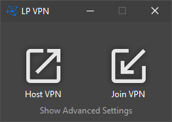
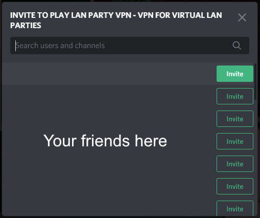

# LAN Party VPN - VPN for Virtual LAN Parties

Have you ever wanted to play a classic game with your friends but is
not able to because you or your friends can get a LAN or VPN set up?

LAN Party VPN (LPVPN) to the rescue! LPVPN allows you to create a VPN
over Discord so you can set up a VPN in seconds. No installation
required!

## Usage

Go to Releases and download one of the precompiled zip packages. Unzip
and run `lpvpn.exe` (with Discord open of course!).

Ask your friends to do the same.

Click on `Host` to host a VPN. Click `Invite` to invite friends on
Discord. Use your Discord client to select which users to invite.

For your friends: click `Join` instead and accept the invitation in
Discord.

You are good to go! Your IP address will be shown in the UI. The VPN
will be disconnected once you close the Application.

## Known Supported Games

Open a PR to add more supported games to the list.

  * Minecraft
  * SWAT 4
  * ARMA 3
